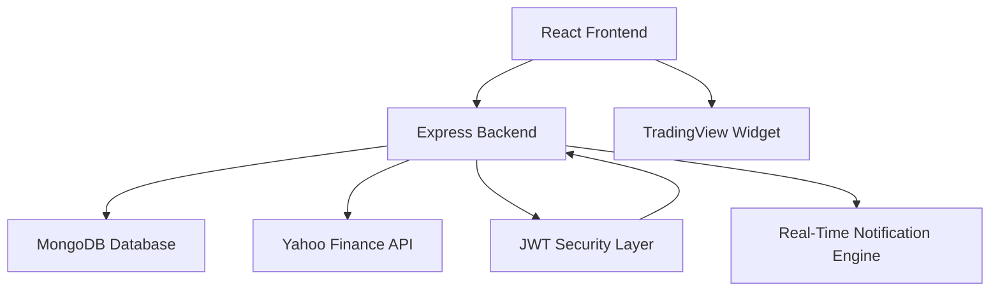

<div align="center">

# Trading App

### A Real-Time Full-Stack Stock Trading Simulator

**Trading App is a secure, scalable MERN stack platform that enables users to simulate stock market trading using live data. It implements real-time market feeds, automated currency conversion, portfolio valuation, and private transaction ledgers—designed with a professional Bento-style architecture.**

Focused on real-world financial software practices such as JWT authentication, transactional integrity, live API integration, and responsive data visualization, this project demonstrates enterprise-grade full-stack development using MongoDB, Express, React, and Node.js.

[Features](https://www.google.com/search?q=%23-key-features) • [Architecture](https://www.google.com/search?q=%23-architecture--flow) • [Tech Stack](https://www.google.com/search?q=%23-tech-stack--architecture) • [Getting Started](https://www.google.com/search?q=%23-getting-started)

</div>

---

## Project Overview

Many beginner trading projects rely on static or hardcoded data. **Trading App** handles real-world market complexities to provide a professional simulation experience.

**Trading App** was built to demonstrate:

* **Live Market Integration**: Real-time price fetching via Yahoo Finance API.
* **Advanced Visualization**: Interactive technical analysis using TradingView charts.
* **Currency Intelligence**: Automatic conversion for global stocks (USD to INR).
* **Transaction Security**: Secure JWT-based authentication and private data isolation.
* **Financial Logic**: Real-time holding validation and balance-aware order processing.
* **User Autonomy**: Self-service wallet management and real-time activity alerts.

---

## Architecture & Flow



### Architectural Highlights

* **MERN Stack** (MongoDB, Express, React, Node.js)
* **Bento Grid UI Design** for a high-density, professional dashboard
* **RESTful API Design** for order management and market data
* **Real-Time Portfolio Valuation** logic (Cash + Live Market Value)
* **Stateless Authentication** using JSON Web Tokens (JWT)
* **Event-Driven Notifications** for instant user feedback on trade execution

---

## Key Features

<table>
<tr>
<td width="50%">

### Market Intelligence

* Live global ticker search (NSE, NASDAQ, NYSE)
* Real-time watchlists with price change indicators
* Professional TradingView candlestick charts
* Global index performance tracking

</td>
<td width="50%">

### Trading Logic

* Instant Buy/Sell execution with automated balance deduction
* Holding validation to prevent selling unowned stocks
* Dynamic currency conversion for international markets
* **Admin Controls**: Global and individual stock trading halts

</td>
</tr>

<tr>
<td width="50%">

### Portfolio & Wallet

* **Self-Funded Wallet**: Users can add balance via a dedicated top-up module
* Real-time Net Worth calculation
* Available liquidity (Buying Power) tracking
* Private Transaction Ledger with specialized "Deposit" tracking

</td>
<td width="50%">

### Live Infrastructure

* **Activity Alerts**: Live notifications for Logins, Buys, Sells, and Deposits
* JWT-based authentication with account suspension checks
* Protected API routes with "stockType" validation integrity
* Robust error handling and theme persistence (Dark/Light mode)

</td>
</tr>
</table>

---

## Tech Stack & Architecture

### Core Technologies

* **Frontend:** React.js (Context API), Tailwind CSS
* **Backend:** Node.js, Express.js
* **Database:** MongoDB (Mongoose ODM)
* **Data Provider:** Yahoo Finance (via yahoo-finance2)
* **Charts:** TradingView Advanced Real-Time Chart Widget

---

### Key Domain Logic

* **Net Worth Formula**: 
$$\text{Available Cash} + \sum (\text{Holding Qty} \times \text{Current Live Price})$$


* **Forex Logic**: Automatic application of simulation conversion rate ($90.00$) for USD-denominated assets.
* **Wallet Integrity**: Direct balance updates with corresponding `DEPOSIT` symbol entries in the transaction ledger for auditing.
* **Notification Polling**: Frontend interval synchronization ensuring alerts reflect live state every 30 seconds.

---

## Getting Started

### Clone the Repository

```bash
git clone https://github.com/your-username/trading-app.git

```

### Configure Environment Variables

Create a `.env` file in the `/server` directory:

```properties
PORT=8000
MONGO_URI=your_mongodb_connection_string
JWT_SECRET=your_jwt_secret_key

```

---

### Run the Application

**Start Backend:**

```bash
cd server
npm run dev

```

**Start Frontend:**

```bash
cd client
npm run dev

```

The application will be accessible at: `http://localhost:5173`

---

## Learning Outcomes

This project demonstrates proficiency in:

* **Financial Data Integrity**: Ensuring "stockType" and "totalPrice" validation across transactional models.
* **Full-Stack Security**: Implementing middleware to block suspended users and isolate private financial data.
* **Live UI Synchronization**: Managing complex state where wallet updates, order history, and notifications refresh in real-time.
* **Admin Orchestration**: Building tools for administrators to halt markets or manage user statuses.

---

<div align="center">

⭐ If this project helped you understand trading terminal architecture, consider starring the repository!

</div>
